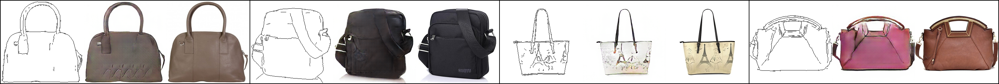

# Pix2Pix in Pytorch

Study Friendly Implementation of Pix2Pix in Pytorch

More Information: [Original Paper](https://arxiv.org/pdf/1611.07004v1.pdf)

Identical Tensorflow Implemenation will be uploaded on [HyeongminLEE's Github](https://github.com/HyeongminLEE)

- GAN: [[Pytorch](https://github.com/taeoh-kim/GANin50lines)][[Tensorflow](https://github.com/HyeongminLEE/GANin50lines)]
- DCGAN: [[Pytorch](https://github.com/taeoh-kim/Pytorch_DCGAN)][[Tensorflow](https://github.com/HyeongminLEE/Tensorflow_DCGAN)]
- InfoGAN: [[Pytorch](https://github.com/taeoh-kim/Pytorch_InfoGAN)][Tensorflow]
- Pix2Pix: [[Pytorch](https://github.com/taeoh-kim/Pytorch_Pix2Pix)][[Tensorflow](https://github.com/HyeongminLEE/Tensorflow_Pix2Pix)]
- DiscoGAN: [[Pytorch](https://github.com/taeoh-kim/Pytorch_DiscoGAN)][[Tensorflow](https://github.com/HyeongminLEE/Tensorflow_DiscoGAN)]

## 1. Environments

- Ubuntu 16.04
- Python 3.6 (Anaconda)
- Pytorch 0.2.0
- Torchvision 0.1.9
- PIL / random

## 2. Code Description

- `pix2pix.py`: Main Code
- `pix2pix_test.py`: Test Code after Training
- `network.py`: Generator and Discriminator
- `db/download.sh`: DB Downloader

## 3. Networks and Parameters

### 3.1 Hyper-Parameters

- Image Size = 256x256 (Randomly Resized and Cropped)
- Batch Size = 1 or 4
- Learning Rate = 0.0002
- Adam_beta1 = 0.5
- Lambda_A = 100 (Weight of L1-Loss)

Use Batch Normalization when Batch Size = 4

Use Instance Normalization when Batch Size = 1

### 3.2 Generator Networks (network.py)

<p align="center"></p>

### 3.3 Discriminator Networks (network.py)

<p align="center"></p>

## 4. DB Download

```bash
./db/download.sh dataset_name
```

dataset_name can be one of [cityscapes, maps, edges2handbags]

- `cityscapes` : 256x256, 2975 for Train, 500 for Val
- `maps` : 600x500, 1096 for Train, 1098 for Val
- `edges2handbags` : 256x256, 138567 for Train, 200 for Val

## 5. Train

### 5.1 edges2handbags

```bash
python pix2pix.py --dataroot ./datasets/edges2handbags --which_direction AtoB --num_epochs 15 --batchSize 4 --no_resize_or_crop --no_flip
```

### 5.2 maps

```bash
python pix2pix.py --dataroot ./datasets/maps --which_direction BtoA --num_epochs 100 --batchSize 1
```

### 5.3 cityscapes

```bash
python pix2pix.py --dataroot ./datasets/cityscapes --which_direction BtoA --num_epochs 100 --batchSize 1
```

## 6. Test

After finish training, saved models are in the `./models` directory.

- `which_direction` , `no_resize_or_crop` and `no_flip` options must be same with Training
- `batchSize` means test sample size
- `num_epochs` is the parameter which model will be used for test

### 6.1 edges2handbags

```bash
python pix2pix_test.py --dataroot ./datasets/edges2handbags --which_direction AtoB --num_epochs 15 --batchSize 4 --no_resize_or_crop --no_flip
```

### 6.2 maps

```bash
python pix2pix_test.py --dataroot ./datasets/maps --which_direction BtoA --num_epochs 100 --batchSize 1
```

### 6.3 cityscapes

```bash
python pix2pix_test.py --dataroot ./datasets/cityscapes --which_direction BtoA --num_epochs 100 --batchSize 1
```

Test results will be saved in `./test_result`


## 7. Results

### [Input | Generated | Ground Truth]

### Edges to Handbags

<p align="center"></p>
<p align="center"></p>
<p align="center"></p>
<p align="center"></p>
<p align="center"></p>
<p align="center"></p>
<p align="center"></p>
<p align="center"></p>

### Maps to Aerials (100 Epochs)

200 Epochs (which is in the Paper) will give better results

<p align="center"></p>
<p align="center"></p>
<p align="center"></p>
<p align="center"></p>
<p align="center"></p>
<p align="center"></p>
<p align="center"></p>
<p align="center"></p>

### Semantic Labels to Street Scenes (100 Epochs)

200 Epochs (which is in the Paper) will give better results

<p align="center"></p>
<p align="center"></p>
<p align="center"></p>
<p align="center"></p>
<p align="center"></p>
<p align="center"></p>
<p align="center"></p>
<p align="center"></p>


